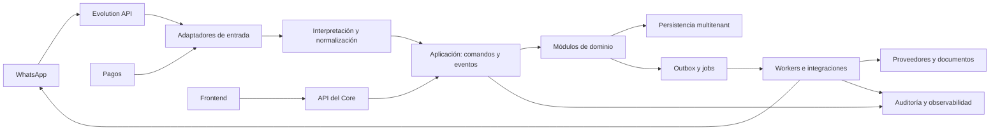

# Arquitectura SPORTEX

## Estilo inicial

SPORTEX comienza como un monolito modular: un Core único, desplegable como una unidad, con límites internos estrictos.

No se crean microservicios al inicio. La separación profesional proviene de contratos, módulos, puertos, eventos, pruebas y ownership; no de multiplicar infraestructura.

## Componentes

## Capas

1. **Entradas:** WhatsApp, pagos, frontend, archivos y proveedores.
2. **Interpretación:** normaliza mensajes y propone hechos con evidencia.
3. **Aplicación:** autentica, autoriza y ejecuta comandos idempotentes.
4. **Dominio:** aplica reglas de clientes, pedidos, costos y producción.
5. **Persistencia:** repositorios, transacciones, auditoría, archivos y versiones.
6. **Salidas:** outbox, workers, notificaciones, documentos e integraciones.

## Reglas de dependencia

- Dominio no depende de WhatsApp, n8n, frontend ni proveedor específico.
- Adaptadores traducen formatos externos a comandos o eventos internos.
- Frontend consume API y no importa repositorios ni reglas del dominio.
- Workers ejecutan efectos previamente autorizados y vuelven a validar el estado.
- Un módulo no escribe tablas de otro módulo; usa su API interna o eventos.
- Seguridad, multitenancy, auditoría y observabilidad atraviesan todas las capas.
- Evolution API se integra directamente con el Core y sus workers; n8n no forma parte de SPORTEX.

## Comandos y eventos

- Un **comando** solicita una acción: `CreateOrder`, `ApproveDesign`, `MoveOrderStage`.
- Un **evento** registra algo ocurrido: `OrderCreated`, `DesignApproved`, `MaterialsCompleted`.

Los comandos pueden rechazarse. Los eventos confirmados son inmutables y se usan para auditoría, proyecciones y automatizaciones.

## Procesos editables

El motor de procesos instancia una plantilla según empresa, producto y versión. La plantilla define etapas, campos requeridos, controles, responsables, documentos, dependencias y plazos.

Editar una plantilla no modifica pedidos ya iniciados salvo migración explícita.

## Proyecciones

Kanban, planilla, dashboard y métricas son vistas derivadas. No son la fuente de verdad y pueden reconstruirse desde el Core.
